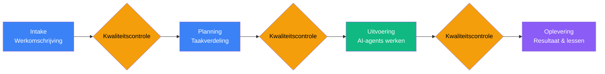

# AI Agent Orchestration Platform

**Executive Summary — Maart 2026**

---

## 1. Wat is dit?

Dit platform is een virtueel softwareontwikkelteam dat volledig uit AI-agents bestaat. Vergelijk het met een goed georganiseerd projectbureau: er zijn onderzoekers, ontwerpers, ontwikkelaars en auditors — maar in plaats van mensen zijn het AI-agents die gestructureerd samenwerken binnen een gedefinieerd werkproces. Elke agent heeft een eigen rol, eigen verantwoordelijkheden en eigen kwaliteitsnormen.

Het verschil met hoe de meeste organisaties AI inzetten — een medewerker die af en toe een vraag stelt aan ChatGPT — is fundamenteel. Dit platform beheert meerdere AI-agents die gelijktijdig werken, elkaars werk controleren, en volgens een vast proces van intake tot oplevering opereren. Het is het verschil tussen een freelancer zonder begeleiding en een ingericht projectteam met processen, kwaliteitscontrole en kennismanagement.

Het systeem draait op de meest geavanceerde AI-modellen die beschikbaar zijn (Anthropic Claude en OpenAI Codex) en combineert hun capaciteiten in een gestructureerde workflow. Het resultaat is een schaalbare, consistente en auditeerbare productiecapaciteit voor kenniswerk — zonder evenredige groei in personeelskosten.

---

## 2. Wat lost het op?

### Kenniswerk opschalen zonder personeel op te schalen

De grootste bottleneck in softwareontwikkeling en kenniswerk is niet technologie — het is beschikbare capaciteit van gekwalificeerde mensen. Werving is duur, duurt lang, en schaalt niet lineair. Dit platform biedt productiecapaciteit die binnen uren opgeschaald kan worden, niet binnen maanden.

### Inconsistente kwaliteit bij ongestructureerd AI-gebruik

Veel organisaties experimenteren met AI, maar zonder structuur leidt dat tot wisselende kwaliteit. De ene medewerker krijgt bruikbare resultaten, de andere niet. Er is geen standaard, geen controle, geen leercurve voor de organisatie. Dit platform dwingt een gestructureerd werkproces af met kwaliteitspoorten bij elke fase. Het resultaat is voorspelbaar en herhaalbaar.

### Vertrouwen en controleerbaarheid

Hoe weet u dat wat een AI oplevert correct is? Bij ongestructureerd gebruik is het antwoord: dat weet u niet. Dit platform lost dat op door auditfuncties in te bouwen. Elke werkfase wordt gecontroleerd voordat de volgende begint. Agents controleren elkaars output voordat werk verder gaat in het proces. Kritieke beslissingen worden geëscaleerd naar menselijke beslissers. Het werk is traceerbaar en navolgbaar.

---

## 3. Hoe werkt het?

Stel u een goed georganiseerde projectmanagementorganisatie voor, maar dan volledig digitaal en geautomatiseerd. Werk doorloopt vier vaste fasen:

**Intake** — Het werk wordt beschreven en gecategoriseerd. Wat moet er gebeuren? Wat zijn de eisen? Dit is vergelijkbaar met het indienen van een projectvoorstel.

**Planning** — Het werk wordt opgedeeld in concrete stappen. Welke agent pakt welk onderdeel op? Welke afhankelijkheden zijn er? Dit is de projectplanning.

**Uitvoering** — Meerdere agents werken gelijktijdig aan hun toegewezen taken. Ze communiceren onderling, signaleren blokkades, en vragen menselijke input wanneer nodig. Dit is de productievloer.

**Oplevering** — Het resultaat wordt gedocumenteerd, gecontroleerd en opgeleverd. Geleerde lessen worden vastgelegd voor toekomstige projecten. Dit is de kwaliteitscontrole en kennisborging.

Bij elke overgang tussen fasen vindt een kwaliteitscontrole plaats. Werk dat niet aan de normen voldoet, gaat terug — niet door naar de volgende fase. Dit voorkomt dat fouten zich opstapelen.

Het systeem selecteert automatisch het juiste type agent voor elke taak: eenvoudige taken worden uitgevoerd door snelle, goedkope modellen; complexe taken door de meest capabele modellen. Dit optimaliseert zowel snelheid als kosten.

---

## 4. Wat maakt het uniek?

### Ingebouwde kwaliteitscontrole

Dit is geen systeem dat tekst genereert en hoopt dat het klopt. Elke werkfase heeft een auditmoment. Agents controleren elkaars output voordat werk verder gaat in het proces. Dit is vergelijkbaar met een four-eyes-principe in de financiële sector.

### Samenwerking tussen meerdere agents

Agents werken niet in isolatie. Een onderzoeker verzamelt informatie, een ontwikkelaar bouwt, een auditor controleert. Ze communiceren, signaleren problemen, en escaleren wanneer nodig. Dit is georganiseerde samenwerking, niet een enkele AI die alles probeert te doen.

### Gestructureerd kennismanagement

Het systeem leert. Na elk afgerond project worden inzichten en conventies vastgelegd. De volgende keer dat vergelijkbaar werk wordt uitgevoerd, profiteert het team van eerder opgedane kennis. Dit is organisatorisch geheugen — iets dat bij individueel AI-gebruik volledig ontbreekt.

### Modulair en uitbreidbaar

Nieuwe vaardigheden, rollen en werkdomeinen kunnen worden toegevoegd zonder het hele systeem te herbouwen. Het platform is ontworpen om mee te groeien met de behoeften van de organisatie en met de voortschrijdende mogelijkheden van AI-technologie.

---

## 5. Wat ontsluit het?

### Productiecapaciteit die niet slaapt

Het platform kan 24 uur per dag, 7 dagen per week werken. Er is geen uitval door ziekte, vakantie of vertrek. Ontwikkelcapaciteit is beschikbaar wanneer het nodig is — ook buiten kantooruren, ook in het weekend.

### Kwaliteit die niet afhangt van volume

Bij menselijke teams neemt de kwaliteit af wanneer het volume toeneemt — mensen maken meer fouten onder druk. Dit systeem levert dezelfde kwaliteit bij tien taken als bij honderd taken. De kwaliteitspoorten functioneren ongeacht de werklast.

### Schaalbaarheid zonder evenredige kostengroei

Een verdubbeling van de productiecapaciteit vereist geen verdubbeling van de kosten. De variabele kosten (AI-gebruik) schalen sublineair ten opzichte van de output, en de vaste kosten (infrastructuur, onderhoud) zijn beperkt.

### Kennisbehoud onafhankelijk van personen

Kennis zit niet in de hoofden van individuele medewerkers die kunnen vertrekken. Het systeem legt conventies, beslissingen en leermomenten structureel vast. Dit elimineert het risico van kennisverlies bij personeelsverloop.

### Snellere iteratiecycli

Doordat meerdere agents parallel werken en het proces geautomatiseerd is, worden doorlooptijden drastisch verkort. Wat normaal dagen kost, kan in uren worden opgeleverd. Dit versnelt time-to-market en vergroot het vermogen om snel te reageren op veranderende eisen.

---

## 6. Risico's en beperkingen

### Afhankelijkheid van externe AI-diensten

Het platform draait op AI-modellen van derden (Anthropic, OpenAI). Prijswijzigingen, beschikbaarheidsproblemen of beleidsveranderingen bij deze leveranciers hebben directe impact op de operatie. Dit risico wordt gemitigeerd door multi-vendor ondersteuning — het systeem is niet afhankelijk van één enkele leverancier.

### Menselijk toezicht blijft noodzakelijk

AI-agents zijn krachtig maar niet onfeilbaar. Voor kritieke beslissingen, creatieve richtingkeuzes en complexe afwegingen blijft menselijke input essentieel. Het systeem is ontworpen om deze escalatie te faciliteren, maar het vervangt geen menselijk oordeelsvermogen — het versterkt het.

### Initiële complexiteit

Het opzetten en configureren van het platform vereist technische expertise. De aanloopinvestering in tijd en kennis is aanzienlijk. Na de initiële inrichting is het operationele beheer echter beperkt.

### Technologie in ontwikkeling

De mogelijkheden van AI-modellen evolueren snel. Het platformontwerp moet bijblijven met deze ontwikkelingen. Dit is zowel een risico (voortdurende aanpassing nodig) als een kans (elke verbetering in de onderliggende modellen verbetert automatisch de output van het platform).

---

## 7. Roadmap

### Huidige fase — Fundament

Het platform is operationeel in een lokale ontwikkelomgeving. Teams van twee tot drie AI-agents werken gelijktijdig aan taken. De kernworkflow (intake, planning, uitvoering, oplevering) is functioneel en bewezen.

### Korte termijn — Cloudmigratie

Deployment naar cloudinfrastructuur (AWS) voor productiegebruik. Dit maakt 24/7 beschikbaarheid mogelijk, onafhankelijk van lokale hardware. Teamsessies draaien op dedicated infrastructuur met gegarandeerde beschikbaarheid.

### Middellange termijn — Opschaling

Ondersteuning voor meerdere gelijktijdige projecten. Uitbreiding van de vaardighedenbibliotheek naar nieuwe werkdomeinen. Verbeterde rapportage en inzichten voor management. Integratie met bestaande bedrijfsprocessen en tooling.

### Lange termijn — Zelfverbeterend systeem

Het platform optimaliseert zijn eigen werkprocessen op basis van opgedane ervaring. Kennis en patronen worden automatisch gedeeld tussen projecten. Het systeem wordt niet alleen productiever met schaal, maar ook slimmer met ervaring.

---

*Dit document is opgesteld ter informatie voor het managementteam. Voor technische details of een demonstratie kan contact worden opgenomen met het ontwikkelteam.*
